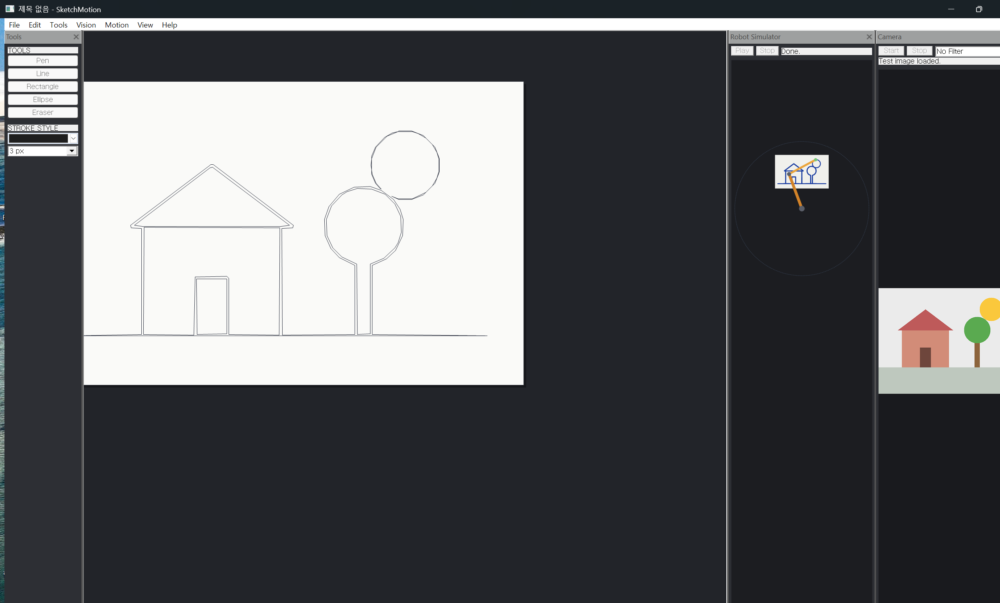

# SketchMotion

**A Vision-to-Motion drawing suite for Windows — draw it, trace it, let a robot arm draw it back.**

SketchMotion is a native Windows desktop application built with **MFC and C++20** that connects three domains that rarely meet in one codebase: vector drawing (GUI), image processing (vision), and motion planning (robotics). It is intentionally structured like industrial equipment software — a central canvas with docking panels — because that is exactly the kind of software MFC is still used for in the real world.

> 한국어 요약은 [아래](#한국어-요약)에 있습니다.

## Status

- **v1 (complete)** — the Vision-to-Motion desktop suite below. Clean Release x64 build, **556 unit-test checks passing**, end-to-end demo captured.
- **v2 (in progress)** — closing the loop with real hardware: an overhead **global-shutter camera + EKF state estimation** drives a real robot arm and a mecanum AGV. The *software* for v2 is built and verified without hardware — a **6-state EKF validated by NIS/NEES χ² consistency tests**, a self-implemented fiducial-marker detector, a holonomic path tracker, and a full closed-loop **virtual integration** against a mock bridge (`tools/e2e_mock.ps1`). Physical hardware bring-up is the remaining step. See [docs/DESIGN_V2.md](docs/DESIGN_V2.md) and [docs/PLAN_V2.md](docs/PLAN_V2.md).

> Why this matters even mid-flight: the hard parts an interviewer would probe — **real-time concurrency (latency budgets, lock-minimized single-writer state, triple buffering), a hand-written EKF proven correct by statistical consistency tests rather than "it looks right", and a device-agnostic bridge protocol** — are all done and testable today. Filters are validated in simulation because that is where ground truth exists; hardware adds real-noise tuning, not correctness.


*Right to left: the Camera pane's test image is traced into vector strokes on the canvas; the 2-link arm in the Robot Simulator pane has just finished redrawing it in ink.*

## The pipeline

```
 Draw on canvas ──┐
                  ├──▶ vector strokes ──▶ path ordering ──▶ G-code (.gcode)
 Webcam frame ────┘        ▲                 (nearest-            │
   │ grayscale → blur      │                  neighbor,           ▼
   │ → Sobel → Otsu        │                  reversal)      2-link robot arm
   └─▶ contour tracing ────┘                                 IK simulation
       (Moore-neighbor → RDP)
```

## Features

| Axis | What it does | How it's built |
|---|---|---|
| **Sketch** | Pen / line / rect / ellipse / eraser, pan & zoom, undo/redo, `.skm` save/load, PNG export | Document/View, Command pattern, GDI+ double buffering |
| **Vision** | Live webcam preview with real-time filters (grayscale, Gaussian blur, Sobel edge, Otsu threshold); one-click "trace frame to canvas" | Windows Media Foundation capture on a worker thread; **every algorithm hand-written — zero OpenCV** |
| **Motion** | Pen-up travel minimization, G-code export ready for pen plotters/3D printers, animated 2-link robot arm that redraws your sketch via inverse kinematics | Nearest-neighbor ordering with path reversal, analytic 2-link IK (law of cosines), 30 ms timer animation |

No webcam? `Vision > Load Test Image` feeds a synthetic scene through the same pipeline, so the full demo always works.

## Architecture

```
SketchMotion.sln
├── Core/       C++20 static library — ZERO framework dependencies
│               geometry, stroke model, filters, Moore-neighbor contour tracing,
│               RDP simplification, path planning, G-code writer, 2-link FK/IK,
│               .skm JSON serialization (hand-rolled parser)
│               v2: 6-state EKF, fiducial-marker detector, holonomic path
│               tracker, homography/Kabsch frame transforms, EMG processor
├── App/        MFC executable — CFrameWndEx + docking panes, dark theme,
│               Media Foundation capture, GDI+ rendering, Command-pattern undo,
│               v2: TCP bridge client (worker thread → PostMessage), hardware pane
├── Tests/      dependency-free console test runner — 556 assertions over Core
├── protocol/   device-agnostic bridge protocol (JSON Lines) + mini JSON parser
├── bridges/    Python arm bridge (myCobot), C++ mock bridges (arm/agv/emg)
├── firmware/   ESP32 mecanum AGV (Arduino), STM32 EMG front-end (bare-metal C)
├── tools/      CI, mock end-to-end integration, header self-containment check
└── docs/       architecture, v2 design/plan, coding conventions
```

The strict Core/App split is the point: **every algorithm is testable without a window handle, a socket, or hardware.** The MFC layer only does what MFC is good at (windows, input, message routing); networking and devices live behind a bridge protocol so a mock can stand in for real hardware. Header self-containment is enforced in CI (`tools/check_selfcontained.ps1`).

Key engineering decisions: [docs/ARCHITECTURE.md](docs/ARCHITECTURE.md) (v1), [docs/DESIGN_V2.md](docs/DESIGN_V2.md) (v2 — threading model, state machine, EKF design), [docs/CONVENTIONS.md](docs/CONVENTIONS.md) (coding standard).

## Building

Requirements: Visual Studio 2022 with the **MFC** component (`C++ MFC for latest v143 build tools`), Windows 10/11 x64.

```
MSBuild SketchMotion.sln /p:Configuration=Release /p:Platform=x64
build\Release\Tests.exe        # 474 checks, 0 failures
build\Release\SketchMotion.exe
```

## Quick demo script

1. Draw something with the pen, or `Vision > Load Test Image` then `Ctrl+T` to trace it to the canvas.
2. `F5` — the 2-link arm in the Robot Simulator pane redraws your sketch (red tip = pen down, green = travel).
3. `Ctrl+G` — export G-code; the dialog reports how much pen-up travel the path optimizer saved.
4. `Ctrl+E` — export PNG.

---

## 한국어 요약

SketchMotion은 **MFC + C++20**으로 만든 Vision-to-Motion 데스크톱 애플리케이션입니다. 드로잉(GUI) → 영상처리(비전) → 경로 생성(모션)이 하나의 파이프라인으로 이어집니다. 장비 제어/머신비전 소프트웨어와 같은 구조(중앙 캔버스 + 도킹 패널)로 설계했습니다.

- **Sketch**: 벡터 드로잉 편집기 — 도구 5종, 팬/줌, Command 패턴 undo/redo, `.skm` 저장, PNG 내보내기
- **Vision**: Media Foundation 웹캠 캡처 + 실시간 필터, 카메라 프레임을 윤곽 추적(Moore-neighbor) → RDP 단순화를 거쳐 벡터 스트로크로 변환. **OpenCV 없이 전부 직접 구현**
- **Motion**: 펜 이동거리 최소화 경로 최적화, 펜 플로터에서 실사용 가능한 G-code 내보내기, 역기구학(IK) 기반 2링크 로봇팔 드로잉 시뮬레이션

Core(알고리즘, 프레임워크 무의존, 단위테스트 474개) / App(MFC UI) / Tests의 3계층 구조로, 모든 알고리즘은 윈도우 없이 테스트 가능합니다. 상세 설계는 [docs/ARCHITECTURE.md](docs/ARCHITECTURE.md) 참조.
